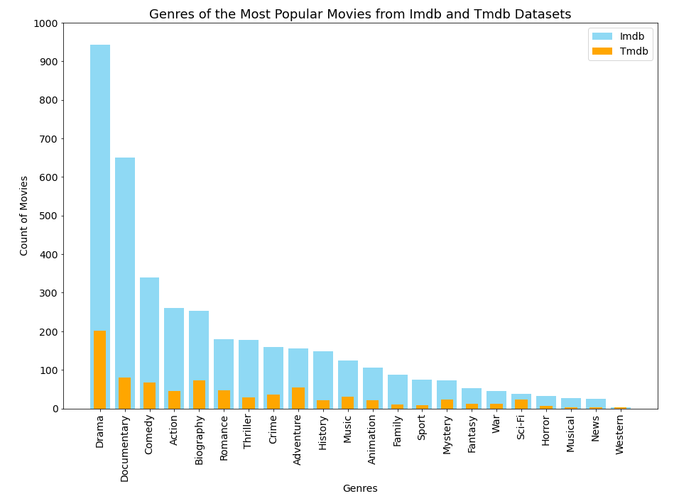
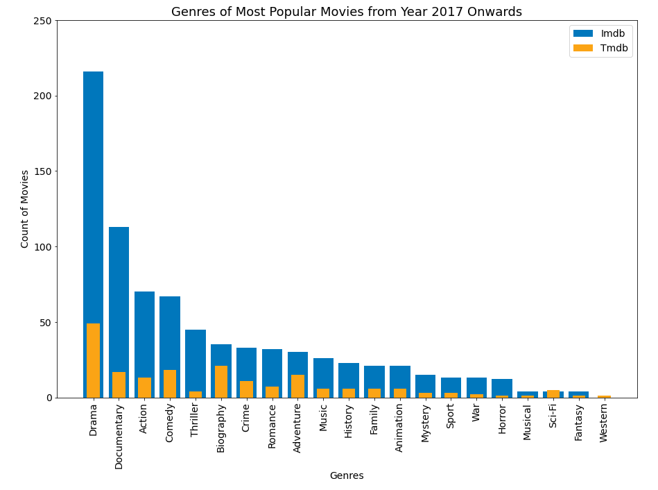
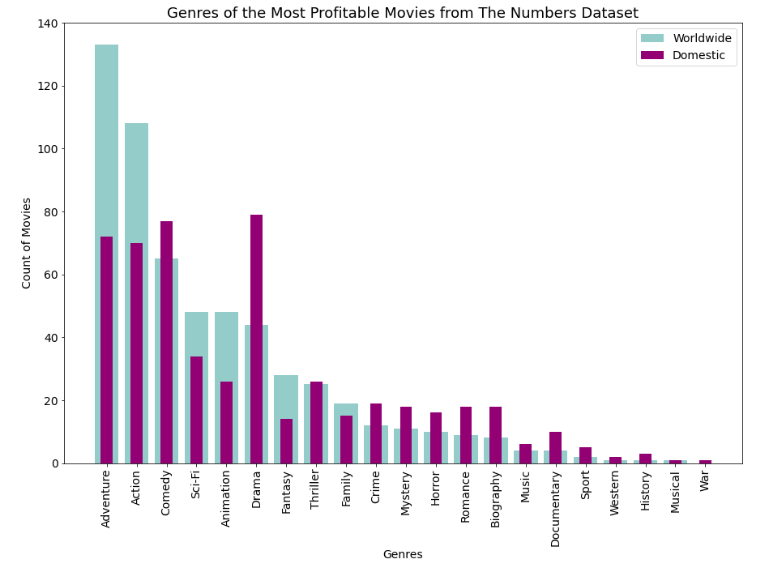

# Top Performing Movie Genres at the Box Office
#### An analysis on the best performing movie genres at the Box Office based on various datasets spanning the years 2010 - 2019
#### By [Collin Owino](https://github.com/Collin9726)

### [Presentation Slides](https://docs.google.com/presentation/d/1Q_SqN1HhzYL2Hv0YmDi9lPpKa5Qb7EdaI9A8lNgkyvs/edit?usp=sharing)

## Description

<table>
<tr>
<td>
In this project, I aim to explore what types of films are doing best at the Box Office based on various datasets. My aim is to advise Microsoft on what types of movies they should create in their newly built movie studio.
</td>
</tr>
</table>

#### Latest updated version is on 1st June 2024.

## Technologies used

1. Python v3.10
2. Jupyter Notebook
3. Pandas
4. Matplotlib
5. SQL

## The Data

Datasets used to analyze movie performance came from the following sources:
- Imdb
- The MovieDB
- The Numbers

Raw data files can be viewed [here](https://github.com/learn-co-curriculum/dsc-phase-1-project-v2-4/tree/master/zippedData).

## Data Analysis
Top performing movies were determined through an analysis of the following metrics:
- Number of votes cast per movie
- Average rating from votes cast
- Financial performance at the Box Office
- A focused review of the more recent data to view any emerging trends

## Findings
#### Genre Popularity by Average Movie Ratings 2010 - 2019

Drama, Documentary, Comedy and Biography have the highest popularity across both Imdb and Tmdb datasets

#### Genre Popularity by Recent Average Movie Ratings 2017 - 2019

Drama, Documentary, Comedy, and Biography are still high on the list across both datasets. Action movies, however, have gained a slight popularity.

#### Financial Performance by Genre

Drama movies perform best in the domestic market. Overall, Adventure, Action, and Comedy have the best financial performance.

## Conclusion
* __Drama:__ Overall, Drama movies enjoy the highest popularity. They have the highest average ratings. In the domestic market, movies in this category return the highest profits.
* __Comedy:__ Humour clearly still has its place in the studio. Comical movies have high average ratings and perform well financially at the box office.
* __Action:__ While Action movies come behind Drama and Comedy in average popularity ratings of the last decade, they still are highly favoured and have gained a popularity in the latter years. That said, these movies have very good financial returns at the box office.
* __Adventure:__ From a business standpoint, this is the category to produce. These movies have the highest return on investment worldwide. Just like Action, this category trails behind Drama and Comedy in popularity ratings but generally are still highly preferred among audiences.

## Contribution
To contribute to this project on any modules, follow these easy steps:

- Fork the repo
- Create a new branch in your terminal (git checkout -b improve-feature)
- Make appropriate changes in file(s)
- Add the changes and commit them (git commit -am "Improve App")
- Push to the branch (git push origin improve-app)
- Create a Pull request

## Support and contact details
For any queries, issues, ideas or concerns contact [Collin Owino](owino.collin@gmail.com). Your feedback is highly appreciated.
### [License](LICENSE)
MIT license
Copyright (c) 2024 **Collin Owino**